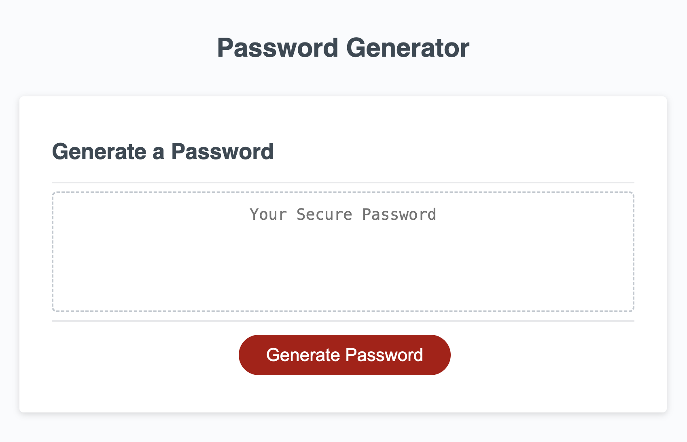

# password-generator
[](https://www.javascript.com) 

A password generator web application that seamlessly generates secure passwords, incorporating both lower and uppercased characters, numbers, and symbols, with a capacity of up to 128 characters.

Live prototype hosted on Github Pages: https://sonictrain.github.io/password-generator/

## Table of Contents 
- [Preview](#preview)
- [Description](#description)
- [Features](#features)
- [Usage](#usage)
- [Credits](#credits)
- [License](#license)

## Preview


## Description
Welcome to the Password Generator, a powerful and user-friendly password generation application. This tool ensures the creation of secure passwords by seamlessly combining lower and uppercased characters, numbers, and symbols. With a generous capacity of at least 8 and up to 128 characters, this password Generator provides a reliable solution for enhancing your security.

## Features
- A password is generated when the related button is clicked.
- A series of prompts is presented to collect from the user the password criteria.
    ### Criteria
    - Length of password: at least 8 characters but no more than 128.
    - Character types:
        - Lowercase
        - Uppercase
        - Numeric
        - Special characters

- The code will validate for each input and **at least one** character type should be selected.
Once prompts are answered then the password is generated and written to the page using the Web API.

## Usage
Simply clone the repo using the following command:
```
git clone <repository-address>
```

cd inside the the repository on your local machine:
```
cd password-generator
```

and finally launch the `index.html` file with a browser of your choice.
Alternatively feel free to visit the web app from [this link](https://sonictrain.github.io/nicola-brucoli-portfolio/).

## Credits
- Fisher-Yates sorting algorithm implemented in this project is based on the excellent explanation and code provided by FreeCodeCamp. Check out the original article: [How to Shuffle an Array of Items using JavaScript or TypeScript](https://www.freecodecamp.org/news/how-to-shuffle-an-array-of-items-using-javascript-or-typescript/).
- [Shield.io](https://shields.io/) for their awesome badges!

## License
[](https://github.com/Naereen/StrapDown.js/blob/master/LICENSE)

Copyright (c) Nicola Brucoli. All rights reserved.
Licensed under the [MIT](./LICENSE) license.